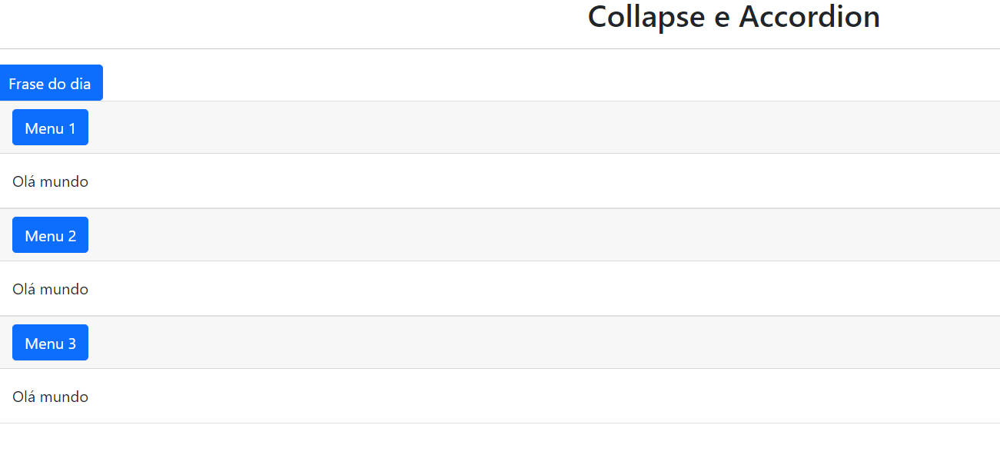

# Curso GIT Provas de TI
## _Curso focado em concurso_

- Versionamento Local
- Versionamento Remoto
- ✨Coloco qualquer texto que queira destacar com marcador ✨





**Aqui uso sinal de maior (>) para colocar um texto com uma linha vertical de destaque**

> Aqui coloco um texto com uma linha destacando
> Possui um recúo


**Quadro**

| Plugin | README |
| ------ | ------ |
| Dropbox | [plugins/dropbox/README.md][PlDb] |
| GitHub | [plugins/github/README.md][PlGh] |
| Google Drive | [plugins/googledrive/README.md][PlGd] |
| OneDrive | [plugins/onedrive/README.md][PlOd] |
| Medium | [plugins/medium/README.md][PlMe] |
| Google Analytics | [plugins/googleanalytics/README.md][PlGa] |


** Aqui uso colchetes para ter um link!**

- [AngularJS] - HTML enhanced for web apps!
- [Ace Editor] - awesome web-based text editor
- [markdown-it] - Markdown parser done right. Fast and easy to extend.
- [Twitter Bootstrap] - great UI boilerplate for modern web apps
- [node.js] - evented I/O for the backend
- [Express] - fast node.js network app framework [@tjholowaychuk]
- [Gulp] - the streaming build system
- [Breakdance](https://breakdance.github.io/breakdance/) - HTML
to Markdown converter
- [jQuery] - duh


**3 acentos agudos (``` sh) Caixa para destacar trecho de código**

```sh
cd dillinger
npm i
node app
```

**Free Software, que beleza!**
**Comentário aleatório**

